# POS Backend API

A Node.js + Express REST API for a point-of-sale system. It provides authentication, user and catalog management, inventory, sales, purchases, expenses, and dashboard analytics. Built with MySQL, JWT auth, and a clean service/controller structure.

A scalable, production-grade **Sales, Inventory, POS, Accounting & Customer Management Backend** designed for real-world business operations. 

This system is built with a **normalized relational database architecture**, ensuring **data integrity, performance, and auditability**.

---

## 🚀 Key Features

### 🔐 Authentication & Security
- Secure user management with role-based access control (Admin, Staff, Manager)
- Refresh token–based authentication
- Account verification & audit-ready login tracking

### 🛒 Sales Management
- Invoice-based sales processing
- Partial & full payments
- Discount, tax, and due calculation
- Refund handling with proper ledger impact
- Cost of Goods Sold (COGS) tracking

### 📦 Inventory Control
- Real-time stock updates
- Purchase batch tracking (FIFO-ready)
- Inventory change logs with references
- Automatic stock reconciliation after sales & refunds

### 👥 Customer & Supplier Management
- Customer dues & payment history
- Supplier payable tracking
- Complete profile & transaction lifecycle
- Address & contact normalization

### 💰 Accounting & Payments
- Unified payment system (cash, bkash, nagad, card, etc.)
- Inward & outward money flow
- Customer & supplier balance automation

### 📊 Reporting-Ready Architecture
- Sales analytics
- Stock movement analysis
- Outstanding dues & payable summaries
- Audit-friendly transaction history

---

## 🏗️ System Architecture Overview

- **Database-Driven Business Logic**
- **Strong Foreign Key Relationships**
- **Transactional Consistency**
- **Scalable for Multi-Store Expansion**


## Highlights

- Modular routes, controllers, services, and validators
- JWT access + refresh tokens with secure cookies
- Rate limiting on protected routes
- MySQL connection pool with `mysql2`
- Cloudinary support for media uploads
- Centralized error handling and logging

## Tech Stack

- Node.js, Express 5
- MySQL (mysql2)
- JWT, bcrypt
- Zod validation
- Cloudinary + Multer

## Project Structure

- `src/app.js` Express app and middleware
- `src/server.js` server bootstrap and startup
- `src/routes/` route modules
- `src/controllers/` request handlers
- `src/services/` business logic
- `src/config/` environment, db, cors, cloudinary
- `src/middleware/` auth, rate limit, error handler
- `sql/` schema and seed scripts

## Getting Started

### 1) Install

```bash
npm install
```

### 2) Configure Environment

Create a `.env` file in the project root:

```env
PORT=3000
NODE_ENV=development

DB_HOST=localhost
DB_USER=your_db_user
DB_PASSWORD=your_db_password
DB_NAME=your_db_name

JWT_ACCESS_SECRET=your_access_secret
JWT_REFRESH_SECRET=your_refresh_secret
JWT_EXPIRES_IN=1h
REFRESH_TOKEN_EXPIRES_IN=1d

CLOUD_NAME=your_cloudinary_name
CLOUD_KEY=your_cloudinary_key
CLOUD_SECRET=your_cloudinary_secret

LOG_LEVEL=info
```

### 3) Database

Run the SQL scripts in `sql/` to create schema and seed data.

### 4) Run

```bash
npm run dev
# or
npm start
```

Health check: `GET /health`

## Default Admin

On startup, the app seeds a default admin if none exists:

- Username: `superadmin`
- Email: `admin@gmail.com`
- Password: `admin123`

Change these credentials in production.

## Database Schema

The following ER diagram represents the complete relational database design
used in this system, covering sales, inventory, accounting, and authentication.




---

## 🗂️ Database Design Highlights

### Core Domains
- **Users & Authentication**
- **Products, Categories & Brands**
- **Sales, Purchases & Returns**
- **Inventory & Batch Tracking**
- **Payments, Expenses & Accounting**
- **Customers & Suppliers**

### Design Principles
- Fully normalized schema
- Explicit financial flow separation
- Clear ownership & traceability
- Minimal redundancy
- High query performance

---

## 📚 Major Tables (High-Level)

| Module | Tables |
|------|-------|
| Authentication | `users`, `refresh_tokens` |
| Product | `products`, `categories`, `brands` |
| Inventory | `inventory_log`, `purchase_items`, `sale_item_batches` |
| Sales | `sales`, `sale_items`, `sale_cogs`, `refunds` |
| Purchases | `purchases`, `purchase_items` |
| Accounting | `payments`, `expenses`, `tax_rates` |
| Customers | `customers`, `customer_dues` |
| Suppliers | `suppliers`, `supplier_dues` |
| Cart System | `carts`, `cart_items` |

---

## 🔄 Inventory & COGS Flow

1. Purchase creates **purchase batches**
2. Sale consumes stock using **batch mapping**
3. COGS calculated per sale item
4. Inventory log records every stock mutation
5. Refund restores stock and updates financials

✔ FIFO-ready  
✔ Audit-safe  
✔ Accounting-accurate  

---

## 🧠 Business Logic Philosophy

- **Database is the single source of truth**
- Financial records are **immutable**
- Stock changes are **event-based**
- Payments are **direction-aware** (`in` / `out`)
- Every monetary action is traceable

---


## 📈 Scalability & Future Enhancements

- Multi-store support
- Warehouse module
- Advanced financial ledger
- Profit & loss statements
- Role-based reporting dashboards
- API rate limiting & monitoring

---


## API Reference

Base path: `/api`

### Auth

| Method | Endpoint        | Auth   | Notes                |
| ------ | --------------- | ------ | -------------------- |
| POST   | `/auth/login`   | Public | Rate limited         |
| POST   | `/auth/refresh` | Public | Refresh access token |
| POST   | `/auth/logout`  | Public | Clear session        |

### Users

| Method | Endpoint                 | Auth         | Notes                                 |
| ------ | ------------------------ | ------------ | ------------------------------------- |
| GET    | `/users`                 | Admin        | List users                            |
| GET    | `/users/me`              | Admin, Staff | Own profile                           |
| GET    | `/users/me/performance`  | Admin, Staff | Own performance                       |
| GET    | `/users/:id`             | Admin        | User details                          |
| GET    | `/users/:id/performance` | Admin        | User performance                      |
| POST   | `/users`                 | Admin        | `multipart/form-data`, image optional |
| PUT    | `/users/:id`             | Admin        | `multipart/form-data`, image optional |
| DELETE | `/users/:id`             | Admin        | Remove user                           |

### Products

| Method | Endpoint        | Auth         | Notes                                 |
| ------ | --------------- | ------------ | ------------------------------------- |
| GET    | `/products`     | Admin, Staff | List products                         |
| GET    | `/products/:id` | Admin, Staff | Product details                       |
| POST   | `/products`     | Admin, Staff | `multipart/form-data`, image optional |
| PUT    | `/products/:id` | Admin, Staff | `multipart/form-data`, image optional |
| DELETE | `/products/:id` | Admin, Staff | Remove product                        |

### Brands

| Method | Endpoint      | Auth         | Notes        |
| ------ | ------------- | ------------ | ------------ |
| GET    | `/brands`     | Admin, Staff | List brands  |
| POST   | `/brands`     | Admin, Staff | Create brand |
| PUT    | `/brands/:id` | Admin, Staff | Update brand |
| DELETE | `/brands/:id` | Admin, Staff | Remove brand |

### Categories

| Method | Endpoint          | Auth         | Notes           |
| ------ | ----------------- | ------------ | --------------- |
| GET    | `/categories`     | Admin, Staff | List categories |
| POST   | `/categories`     | Admin, Staff | Create category |
| PUT    | `/categories/:id` | Admin, Staff | Update category |
| DELETE | `/categories/:id` | Admin, Staff | Remove category |

### Suppliers

| Method | Endpoint                                             | Auth         | Notes                                 |
| ------ | ---------------------------------------------------- | ------------ | ------------------------------------- |
| GET    | `/suppliers`                                         | Admin, Staff | List suppliers                        |
| GET    | `/suppliers/:id/details`                             | None         | Supplier details                      |
| GET    | `/suppliers/:supplier_id/products`                   | None         | Supplied products                     |
| GET    | `/suppliers/:supplier_id/products_summary`           | None         | Summary                               |
| GET    | `/suppliers/:supplier_id/supplied/:product_id`       | None         | Product details                       |
| GET    | `/suppliers/:id/transactions`                        | None         | Transactions                          |
| GET    | `/suppliers/:id/transactions/summary`                | None         | Transaction summary                   |
| GET    | `/suppliers/:supplierId/purchases/:purchaseId/items` | None         | Purchase items                        |
| GET    | `/suppliers/:supplier_id/dues`                       | None         | Due details                           |
| POST   | `/suppliers`                                         | Admin        | `multipart/form-data`, image optional |
| POST   | `/suppliers/:supplier_id/due-payment`                | None         | Record payment                        |
| PUT    | `/suppliers/:id`                                     | Admin        | `multipart/form-data`, image optional |
| DELETE | `/suppliers/:id`                                     | Admin        | Remove supplier                       |

### Customers

| Method | Endpoint                                                 | Auth         | Notes                                 |
| ------ | -------------------------------------------------------- | ------------ | ------------------------------------- |
| GET    | `/customers`                                             | Admin, Staff | List customers                        |
| GET    | `/customers/:id/details`                                 | Admin, Staff | Customer details                      |
| GET    | `/customers/:id/transactions`                            | None         | Transactions                          |
| GET    | `/customers/:id/transactions/summary`                    | None         | Transaction summary                   |
| GET    | `/customers/:customerId/sales/:saleId/items`             | None         | Sale items                            |
| GET    | `/customers/:customerId/purchased_products`              | None         | Purchased products                    |
| GET    | `/customers/:customerId/products_summary`                | None         | Summary                               |
| GET    | `/customers/:customer_id/purchased_products/:product_id` | None         | Product details                       |
| GET    | `/customers/:customer_id/dues`                           | None         | Due details                           |
| POST   | `/customers`                                             | Admin, Staff | `multipart/form-data`, image optional |
| POST   | `/customers/:customer_id/dues`                           | None         | Record payment                        |
| PUT    | `/customers/:id`                                         | Admin, Staff | `multipart/form-data`, image optional |
| DELETE | `/customers/:id`                                         | Admin, Staff | Remove customer                       |

### Purchases

| Method | Endpoint    | Auth | Notes           |
| ------ | ----------- | ---- | --------------- |
| POST   | `/purchase` | None | Create purchase |
| GET    | `/purchase` | None | List purchases  |

### Sales

| Method | Endpoint                  | Auth | Notes              |
| ------ | ------------------------- | ---- | ------------------ |
| POST   | `/sales/checkout`         | None | Checkout sale      |
| POST   | `/sales/pending`          | None | Save pending sale  |
| POST   | `/sales/complete_pending` | None | Complete pending   |
| GET    | `/sales/pending`          | None | List pending sales |
| GET    | `/sales`                  | None | List sales         |

### Expenses

| Method | Endpoint    | Auth | Notes          |
| ------ | ----------- | ---- | -------------- |
| GET    | `/expenses` | None | List expenses  |
| POST   | `/expenses` | None | Create expense |

### Inventory

| Method | Endpoint         | Auth | Notes            |
| ------ | ---------------- | ---- | ---------------- |
| GET    | `/inventory`     | None | Inventory logs   |
| POST   | `/inventory`     | None | Add log entry    |
| DELETE | `/inventory/:id` | None | Remove log entry |

### Dashboard

| Method | Endpoint                                       | Auth         | Notes               |
| ------ | ---------------------------------------------- | ------------ | ------------------- |
| GET    | `/dashboard/main`                              | Admin, Staff | Main dashboard      |
| GET    | `/dashboard/transactions`                      | Admin        | All transactions    |
| GET    | `/users/:id/transactions`                      | Admin        | User transactions   |
| GET    | `/users/:id/summary`                           | Admin        | User summary        |
| GET    | `/users/:id/transactions/summary`              | Admin        | User summary        |
| GET    | `/users/me/transactions`                       | Admin, Staff | Own transactions    |
| GET    | `/users/me/summary`                            | Admin, Staff | Own summary         |
| GET    | `/dashboard/financial-summary`                 | Admin        | Financial summary   |
| GET    | `/dashboard/daily-trends`                      | Admin        | Daily trends        |
| GET    | `/dashboard/top-products`                      | Admin        | Top products        |
| GET    | `/dashboard/customer-analysis`                 | Admin        | Customer analysis   |
| GET    | `/dashboard/customer-analysis/comprehensive`   | Admin        | Full analysis       |
| GET    | `/dashboard/staff-performance`                 | Admin        | Staff performance   |
| GET    | `/dashboard/payment-breakdown`                 | Admin        | Payment breakdown   |
| GET    | `/dashboard/tax-summary`                       | Admin        | Tax summary         |
| GET    | `/dashboard/profit-loss`                       | Admin        | Profit and loss     |
| GET    | `/dashboard/inventory/alerts`                  | Admin        | Inventory alerts    |
| GET    | `/dashboard/inventory/movement`                | Admin        | Stock movement      |
| GET    | `/dashboard/inventory/reorder-recommendations` | Admin        | Reorder suggestions |
| GET    | `/dashboard/inventory/valuation`               | Admin        | Inventory valuation |
| GET    | `/dashboard/inventory/detailed`                | Admin        | Detailed inventory  |
| GET    | `/dashboard/product-analysis`                  | Admin        | Product analysis    |
| GET    | `/dashboard/financial-analysis`                | Admin        | Financial analysis  |

## Examples

### Login

Request

```http
POST /api/auth/login
Content-Type: application/json

{
	"email": "admin@gmail.com",
	"password": "admin123"
}
```

Response

```json
{
  "message": "Login successful",
  "accessToken": "<jwt>",
  "user": {
    "id": 1,
    "name": "superAdmin",
    "role": "admin"
  }
}
```

### Create Brand

Request

```http
POST /api/brands
Authorization: Bearer <token>
Content-Type: application/json

{
	"name": "Acme"
}
```

Response

```json
{
  "message": "Brand created",
  "data": {
    "id": 12,
    "name": "Acme"
  }
}
```

### List Products

Request

```http
GET /api/products
Authorization: Bearer <token>
```

Response

```json
{
  "data": [
    {
      "id": 101,
      "name": "Blue T-Shirt",
      "sku": "TS-001",
      "price": 19.99,
      "stock": 25
    }
  ]
}
```

### Purchase Flow (Create + List)

Request

```http
POST /api/purchase
Content-Type: application/json

{
	"supplier_id": 5,
	"invoice_no": "PO-2026-001",
	"purchase_date": "2026-02-08",
	"items": [
		{
			"product_id": 101,
			"quantity": 10,
			"cost_price": 8.5
		}
	],
	"paid_amount": 50,
	"note": "Initial stock"
}
```

Response

```json
{
  "message": "Purchase created",
  "purchase_id": 2301
}
```

Request

```http
GET /api/purchase
```

Response

```json
{
  "data": [
    {
      "id": 2301,
      "supplier_id": 5,
      "total": 85,
      "paid_amount": 50,
      "due_amount": 35,
      "purchase_date": "2026-02-08"
    }
  ]
}
```

### Sales Flow (Pending + Checkout)

Request

```http
POST /api/sales/pending
Content-Type: application/json

{
	"customer_id": 12,
	"items": [
		{
			"product_id": 101,
			"quantity": 2,
			"unit_price": 19.99
		}
	],
	"note": "Hold for pickup"
}
```

Response

```json
{
  "message": "Pending sale saved",
  "pending_id": 901
}
```

Request

```http
POST /api/sales/checkout
Content-Type: application/json

{
	"customer_id": 12,
	"payment_method": "cash",
	"paid_amount": 39.98,
	"items": [
		{
			"product_id": 101,
			"quantity": 2,
			"unit_price": 19.99
		}
	]
}
```

Response

```json
{
  "message": "Sale completed",
  "sale_id": 5502,
  "total": 39.98,
  "due_amount": 0
}
```

## Scripts

- `npm run dev` start with nodemon
- `npm start` start in production mode

## Notes

- Protected routes require authentication (`Authorization: Bearer <token>`).
- Rate limiting is applied to protected routes.

## License

ISC


---

## ⭐ Final Note

This project is designed with **real-world business complexity** in mind and follows **industry-grade backend engineering practices**.

If you find this useful, consider giving it a ⭐ on GitHub.
